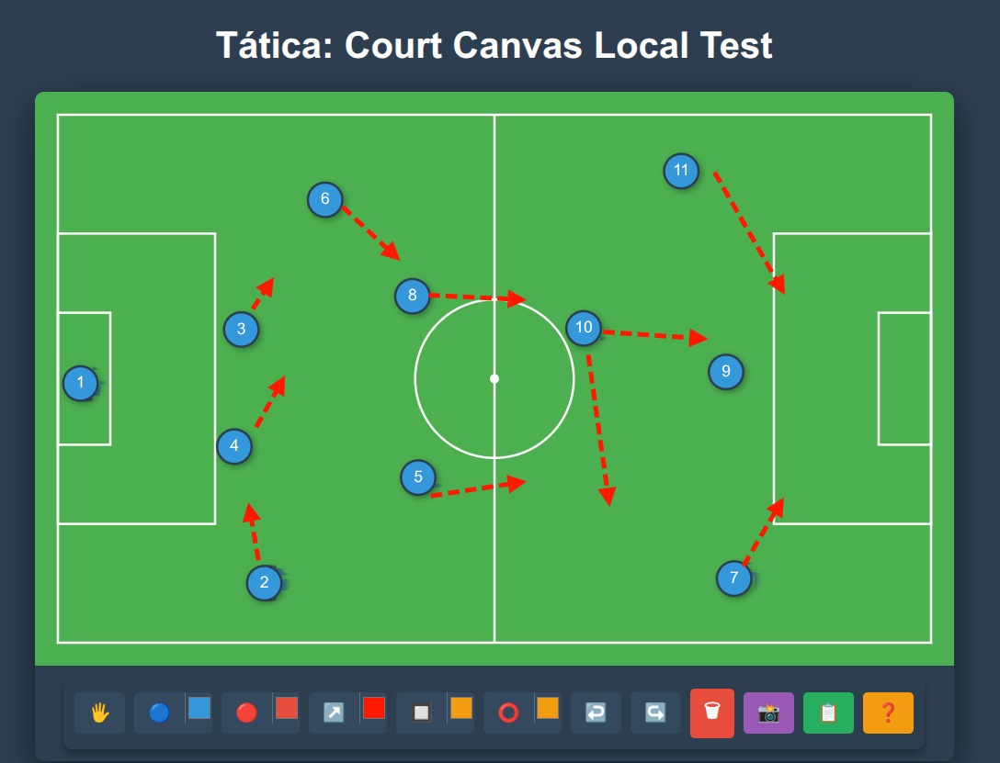

#  Court Canvas
Uma biblioteca **agnóstica, modular e focada na renderização vetorial** (2D) de pranchetas táticas esportivas baseada em *Konva.js*.



O **Court Canvas** permite criar rapidamente um campo de futebol interativo onde você pode arrastar jogadores, desenhar marcações geométricas (retângulos, elipses, setas directionais) e, mais importante, **serializar e extrair** esse estado para JSON e Imagens (.png) para salvar tudo num banco de dados.

## ✨ Funcionalidades (O que o Motor Faz?)
- 🏟️ **Design Preciso:** Background matemático renderizando grandes e pequenas áreas perfeitamente dimensionadas.
- 🖐 **Interatividade Completa (Drag & Drop):** Padrão *State* nas ferramentas (clique e arraste jogadores para construir a tática).
- 🧱 **Bounding Box Auto-Ajustável:** Suas peças de xadrez não saem para fora da linha do campo; algoritmos matemáticos seguram os elementos nas bordas corretas!
- 🎨 **Customização Nativa:** A Toolbar possui seletores automáticos de cor da engine. Modifique a cor da equipe, estilos e passes perfeitamente na barra!
- ⏪ **Viajante do Tempo:** Histórico de Estado 100% autônomo. Botões e Teclas de Atalho (`CTRL+Z` e `CTRL+Y`) suportados para desfazer e refazer marcações.
- 📸 **Exportação e Importação:** Salve sua tática em `JSON` para carregar num backend, ou renderize uma imagem em HQ (`.png`) da tática em um instante. Você também pode **reimportar** payloads JSON para continuar editando táticas salvas!
- ✨ **Popups UI Modernos:** Prompts de renomeação de jogadores (`dblclick`), importação de dados e caixas de ajuda alimentadas pelo `SweetAlert2` nativamente.
- ⚛️ **Integração Agnóstica:** Pode ser executado em *Vanilla JS*, *ReactJS* ou *VueJS*.

---

## 🛠 Desenvolvimento e Infraestrutura (Docker)

Para garantir que todos os desenvolvedores usem a mesma versão do Node.js (v24+) e evitar conflitos de sistema, o projeto utiliza uma infraestrutura containerizada. **Você não precisa ter o Node instalado na sua máquina**, apenas o Docker.

### Comandos de Atalho:
Use os scripts na pasta `infra/` para rodar comandos NPM ou Node dentro do container:

```bash
# Instalar dependências
./infra/npm install

# Rodar o servidor de desenvolvimento
./infra/npm run dev

# Rodar qualquer comando NPX
./infra/npx vitest
```

> 💡 **Dica:** O container mapeia automaticamente o seu usuário (`UID/GID`) e possui um volume de cache para o NPM, tornando a instalação de pacotes extremamente rápida.

---

## 🚀 Instalação (Uso em Produção)

O pacote está oficialmente distribuído no NPM Registry:
```bash
npm install @mlalbuquerque/court-canvas
```

---

## 💻 Exemplos de Uso (Demos)

### 1. Vanilla JavaScript (O HTML puro)
```html
<div id="meu-campo"></div>
<script type="module">
  import { CourtCanvas } from '@mlalbuquerque/court-canvas';

  // Inicialização simples
  const court = new CourtCanvas('meu-campo', { width: 800, height: 500 });

  // Carregando um estado salvo (JSON)
  const savedState = '{"className":"Layer","children":[...]}';
  const courtWithState = new CourtCanvas('outro-campo', { initialState: savedState });
</script>
```

*(Suporte para React e Vue também disponível via `@mlalbuquerque/court-canvas/react` e `@mlalbuquerque/court-canvas/vue`).*

---

## 🧪 Qualidade e Segurança

O projeto possui um fluxo rigoroso de Garantia de Qualidade (QA):

### 1. Testes Automatizados
- **Unitários (Vitest):** Focados na lógica do `StateManager`, `Exporters` e `Tools`.
- **E2E (Playwright):** Validam o fluxo completo do usuário no navegador.

```bash
./infra/npm run test       # Roda testes unitários
./infra/npm run test:e2e   # Roda testes de ponta a ponta
```

### 2. Bloqueio de Push (Husky)
Existe um "Git Hook" configurado que impede o envio de código para o servidor (`git push`) se os testes não estiverem passando. Isso garante que a `main` esteja sempre estável.

### 3. CI/CD (GitHub Actions)
Toda alteração enviada ao GitHub dispara automaticamente o **Test Suite** na nuvem para uma validação final em ambiente limpo.

---

## 🛠 Arquitetura do Pacote
* `src/core/`: Núcleo algorítmico agnóstico focado em *Konva.js*.
* `src/core/Tools/`: Ferramentas de interação (*PlayerTool*, *ArrowTool*, etc).
* `src/core/Exporters/`: Formatadores de saída (`JsonExporter` e `ImageExporter`).
* `src/react/` e `src/vue/`: Wrappers para frameworks UI modernos.
